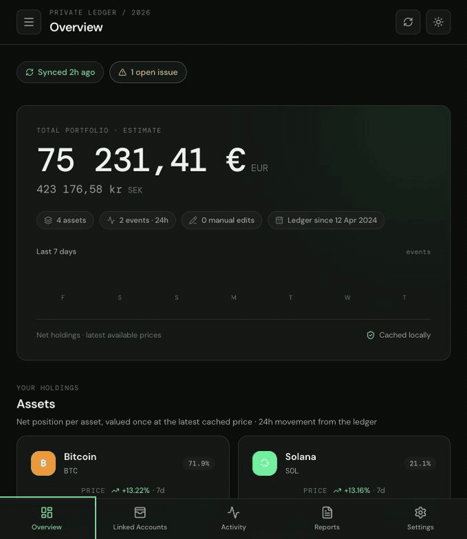
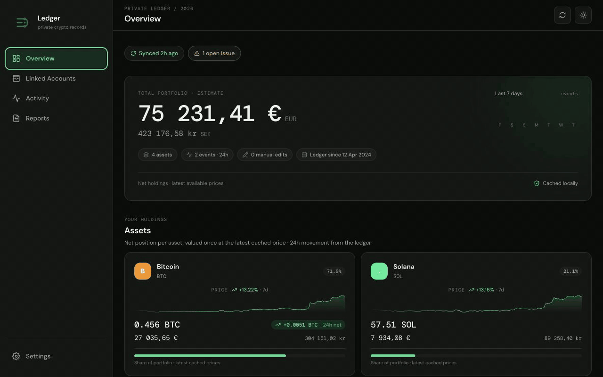

<h1> Crypto Ledger</h1>

An evidence-first crypto portfolio, activity, reporting, and tax workspace. Crypto Ledger keeps a durable local ledger from connected exchanges, wallets, nodes, and manual entries, then lets you review, correct, export, back up, and report on that history without making a tax package the source of truth.

> **Project status:** beta release candidate `v0.2.0-beta.1`. The application is usable locally and suitable for evaluation or self-hosted testing, but APIs, database migrations, tax integrations, and UI details may still evolve before a stable release.

## What it does

- Connects exchange accounts, wallet addresses, blockchain networks, and manual sources.
- Ingests source activity while preserving raw evidence and sync metadata.
- Builds a canonical event ledger with explicit user overrides instead of silently rewriting history.
- Flags incomplete or conflicting events and provides review, linking, valuation, fee, and issue-resolution workflows.
- Supports activity pagination, filters, event detail, manual adjustments, and account-level synchronization/backfill controls.
- Values events in configurable display and quote currencies using the configured price provider.
- Produces ledger CSV, accountant PDF, evidence archives, tax CSV, and optional RP2-oriented outputs.
- Provides encrypted backups, backup verification, restore, download, and evidence-archive import flows.
- Keeps operational settings in the Settings page: currencies, price-provider credentials, synchronization, backups, security, data, tax integrations, and advanced options.
- Includes a demo mode for exploring the product with synthetic history.

## Product tour

Here is a short looping tour of the demo workspace. It moves through the main product surfaces using synthetic data only:

<p align="center">
  
</p>

Individual captures are available for closer inspection:

- [Overview](docs/media/overview.png)
- [Linked Accounts](docs/media/linked-accounts.png)
- [Activity review](docs/media/activity.png)
- [Reports](docs/media/reports.png)
- [Security settings](docs/media/settings-security.png)

The desktop layout has its own showcase as well:



Desktop captures:

- [Desktop Overview](docs/media/desktop-overview.png)
- [Desktop Linked Accounts](docs/media/desktop-linked-accounts.png)
- [Desktop Activity](docs/media/desktop-activity.png)
- [Desktop Reports](docs/media/desktop-reports.png)
- [Desktop Security settings](docs/media/desktop-settings-security.png)

Additional recordings belong in [`docs/media`](docs/media/README.md) and must follow the naming and redaction guidance there. Recommended showcase sequence:

1. Overview: health, balances, and recent activity.
2. Linked accounts: connect a source and run a sync/backfill.
3. Activity: inspect an event, resolve an issue, and apply a review override.
4. Reports: preview readiness and export an accountant package.
5. Settings: configure currencies, synchronization, backups, secrets, and tax integrations.

## Architecture

```text
┌──────────────────────────────┐       HTTP        ┌─────────────────────────────┐
│ React + TypeScript web app   │ ────────────────> │ FastAPI application          │
│ Overview · Accounts ·        │                   │ Local API boundary           │
│ Activity · Reports · Settings│                   │ Domain services + exporters  │
└──────────────────────────────┘                   └──────────────┬──────────────┘
                                                                  │ SQLAlchemy
                                                                  ▼
                                                        ┌─────────────────────────┐
                                                        │ SQLite / configured DB   │
                                                        │ raw evidence + ledger    │
                                                        │ issues + backups         │
                                                        └─────────────────────────┘

                  exchanges · wallets · nodes · manual entries
                                      │
                                      ▼
                           connectors and source adapters
```

The canonical ledger is the application’s durable model. RP2 is an optional tax/reporting integration and is not the application’s database or historical source of truth. This boundary lets the ledger remain useful if an external tax tool changes, is unavailable, or is removed.

## Supported source types

The current connector surface includes:

- Bitget and Binance exchange accounts.
- Bitcoin addresses.
- EVM addresses across Ethereum, Arbitrum, Base, Polygon, Optimism, Avalanche C-Chain, BNB Smart Chain, and configured EVM networks.
- Solana addresses.
- Manual activity and adjustment entries.
- Wallet-software metadata such as MetaMask, Rabby, Cake, Exodus, and Phantom.

Connector availability depends on credentials, network access, rate limits, and account permissions. Never provide a seed phrase or private key to a connector; the linked-account UI is designed around public addresses and read-only exchange access where possible.

EVM sources keep the selected network separate from the address. Empty explorer responses such as “No token transfers found” are treated as a successful empty history. Avalanche uses Routescan’s indexed API. Explorer credentials are configured once in **Settings → Providers** and shared by compatible wallet sources. For BNB Smart Chain, an optional BSCTrace/MegaNode key enables indexed native BNB, internal, BEP-20, ERC-721/1155, and contract-call history plus current token holdings. Without a key, the app keeps a keyless public-RPC fallback for native balance and the default USDC/WBNB transfer logs, with the fallback’s coverage limits shown after sync. Existing per-source Etherscan-compatible BSC configurations remain supported. Other EVM networks can be added with their chain ID and an Etherscan-compatible explorer endpoint.

### Exchange history windows

Private Bitget history APIs expose only a limited recent window, generally up to 90 days or three months depending on the product. Futures, account bills, financial records, Earn records, copy-trading transfers, and bot-related activity older than that window cannot be recovered by pressing Sync again. For older history, export the records or statements from Bitget and preserve them as evidence. The legacy Bitget import endpoint accepts a normalized JSON array with `id`, `type`, `timestamp`, `coin`, and `amount` fields; official CSV/PDF statements can also be retained as attachments or used to create reviewed manual entries. Exchange exports should be kept alongside the encrypted Crypto Ledger backup.

## Core data and audit model

Crypto Ledger separates four ideas that are easy to conflate in financial software:

1. **Raw evidence** — the source payload, import file, or manually entered basis retained for auditability.
2. **Canonical event** — the normalized event used by balances, activity, reports, and tax preparation.
3. **User review** — explicit corrections, links, valuations, fees, and notes attached to an event.
4. **Effective event** — the canonical event plus approved review decisions used by downstream calculations.

When an event has an issue, the application keeps the evidence and exposes a path to resolve it. Updating the missing or incorrect information can make the issue clear automatically; some issues still require an explicit Resolve action so the user can record that review was completed.

## Quick start with Docker

From the repository root:

```bash
cp .env.example .env
# Edit .env and set a strong backup encryption key before using real data.
docker compose up --build
```

For a deployment, pass the public API origin at build time, for example:

```bash
VITE_API_URL=https://api.example.com docker compose build web
```

Open `http://localhost:5173`. The API is available at `http://localhost:8000` and its OpenAPI document at `http://localhost:8000/docs`.

The Compose web image is a production-style static build served by Nginx. The default Compose configuration enables demo data. Set `DEMO_MODE=false` in `.env` before starting if you want an empty local workspace, and set `VITE_API_URL` to the externally reachable API origin when the web client is not being opened on the same machine.

## Local development

### API

```bash
cd api
python3 -m venv .venv
.venv/bin/pip install -r requirements.txt
cp ../.env.example ../.env
.venv/bin/alembic upgrade head
.venv/bin/uvicorn app.main:app --reload --port 8000
```

### Web

In a second terminal:

```bash
cd web
npm ci
npm run dev
```

Or use the repository helper after dependencies are installed:

```bash
./scripts/dev.sh
```

The web client reads `VITE_API_URL` when it needs an API origin; local development defaults to the API served on port 8000.

## Configuration

Copy `.env.example` to `.env`. The active `.env` is ignored by Git and must never be committed.

| Variable | Purpose | Safe local guidance |
| --- | --- | --- |
| `DATABASE_URL` | SQLAlchemy database URL | The example uses a local SQLite file. |
| `DEMO_MODE` | Seeds synthetic demo history on API startup | Use `true` for a tour; use `false` for a clean workspace. |
| `BACKUP_ENCRYPTION_KEY` | Encrypts application backup archives | Generate a long random value and store it outside the repository. |
| `APP_SECRET_KEY` | Application-level secret where supported by deployment | Generate and manage it as a deployment secret. |
| `VITE_API_URL` | Web client API origin | Set it when the API is not on the local default. |

Price-provider credentials are configured in **Settings → Providers** and are stored through the application’s encrypted secret flow. They are not read from environment variables.

## Backups and recovery

Before importing real history or changing encryption configuration:

1. Set and securely store the backup encryption key.
2. Run a backup from Settings → Backups.
3. Download the resulting archive and keep it in a separate, protected location.
4. Verify the archive before relying on it for recovery.
5. Test restore with a disposable database before a production recovery.

An evidence archive is useful when transferring source material or preserving a review package. It is not a replacement for an encrypted full backup. Treat exported archives, CSV files, PDFs, and downloaded reports as sensitive financial records.

## RP2 integration and licensing boundary

RP2 is used as an optional integration for country-specific tax/reporting workflows. Crypto Ledger does not copy RP2 source code into this repository, does not relicense RP2, and does not make RP2 a prerequisite for the canonical ledger. The integration invokes the documented RP2 command/plugin surface when configured by the user.

The official RP2 project identifies itself as Apache License 2.0 licensed and documents country-specific commands and a plugin architecture:

- [RP2 repository](https://github.com/eprbell/rp2)
- [RP2 license](https://github.com/eprbell/rp2/blob/main/LICENSE)
- [RP2 developer guide](https://github.com/eprbell/rp2/blob/main/README.dev.md)
- [RP2 package metadata](https://pypi.org/project/rp2/)

For a distribution that bundles RP2 or another third-party component, preserve that component’s copyright, license text, and notices. Do not imply that RP2 endorses Crypto Ledger. See [`THIRD_PARTY_NOTICES.md`](THIRD_PARTY_NOTICES.md) for the repository’s current boundary statement. This documentation is a practical project policy, not legal advice; obtain a legal review before redistributing bundled artifacts or offering a hosted service.

To use an RP2 country connection or plugin, install the compatible package according to that plugin’s own documentation, configure the relevant country/plugin in the app’s tax-integration settings, and run the generated output through the documented RP2 workflow. Keep plugin packages and their licenses separate from this repository unless you have confirmed their redistribution terms.

### Tax and financial disclaimer

Crypto Ledger is record-keeping and reporting software, not tax, legal, accounting, or investment advice. Tax treatment varies by jurisdiction and can change. Review the canonical ledger, valuations, fees, transfers, and generated outputs with a qualified professional before filing or making financial decisions.

**No tax responsibility:** The project author, contributors, and maintainers are not responsible for tax problems or other consequences arising from use of Crypto Ledger, including incorrect filings, omitted transactions, inaccurate valuations, tax assessments, penalties, interest, audits, or financial losses, to the maximum extent permitted by applicable law. You remain responsible for reviewing the data and obtaining professional advice before relying on any report.

## API surface

The FastAPI service currently groups endpoints by domain:

| Area | Examples |
| --- | --- |
| Accounts | Create, edit, sync, backfill, pause/resume, archive, restore, delete |
| Events | Paginated activity, detail, manual events, review overrides, links, valuations, fees |
| Issues | List, resolve, and link account issues |
| Backups | List, run, upload, verify, download, and restore |
| Settings | Read, patch, reset, status, and secret inventory operations |
| Reports | Readiness, ledger CSV, evidence ZIP, accountant PDF, and evidence verification/import |
| Tax | Countries, languages, readiness, reports, PDF/CSV outputs, and RP2 outputs |
| Attachments and prices | Evidence attachments and configured price-provider lookups |

For exact request/response schemas, run the API and open `/docs` or `/redoc`.

## Security and privacy expectations

- Use read-only exchange keys and the smallest permissions needed.
- Never enter seed phrases or private keys into the application.
- Do not commit `.env`, database files, backup archives, exports, screenshots, or recordings containing personal data.
- Keep encryption and backup keys in a password manager or deployment secret store.
- Run the app behind appropriate authentication, TLS, network controls, and operational backups before exposing it beyond a trusted local machine.
- Review exports before sharing them with an accountant or tax authority.
- Demo mode is synthetic and should not be used as evidence for a real tax filing.

## Testing and quality checks

From the repository root:

```bash
cd web
npm run build

cd ../api
.venv/bin/python -m unittest discover -s tests -p 'test_*.py'
```

The web build catches TypeScript and production-bundle issues. The API suite covers migrations, connectors, event workflows, reports, backups, settings, and tax integration behavior. Add focused tests with every connector, schema, or export change.

For an isolated recovery/import smoke test that never touches the configured database, run:

```bash
api/.venv/bin/python scripts/verify_release.py
```

To upgrade a representative pre-release ledger fixture from the initial schema through the current head:

```bash
api/.venv/bin/python scripts/verify_migrations.py
```

## Release checklist

- [x] Review `docs/Project-overview.md` and update this README when the product surface changes.
- [x] Confirm `.env` and local databases/backups are ignored and absent from the release archive.
- [x] Run the web build and API test suite.
- [x] Run a migration check against a fresh database and a representative persisted fixture (`scripts/verify_migrations.py`).
- [x] Verify backup, download, archive verification, and restore flows (`scripts/verify_release.py`).
- [ ] Review screenshots/videos for secrets, addresses, filesystem paths, and personal information.
- [x] Recheck all bundled third-party notices and licenses, especially optional RP2/plugin packages.
- [ ] Set `DEMO_MODE=false` for a real deployment and configure secrets through the deployment environment or Settings.
- [x] Create release notes that call out schema, connector, tax, and backup compatibility (`CHANGELOG.md`).

## Repository map

```text
api/                    FastAPI service, domain logic, migrations, tests
web/                    React + TypeScript client and public assets
docs/                   Product overview and media guidance
scripts/                Local development helpers
.env.example            Safe configuration template
docker-compose.yml      Local multi-service development setup
LICENSE                 Project license
THIRD_PARTY_NOTICES.md  Third-party licensing boundary and notices
```

## Contributing

Small, focused changes are easiest to review. Please include tests for behavior changes, update migrations when persistence changes, document connector or export compatibility, and avoid committing generated data or secrets. For UI work, verify both desktop and phone layouts.

## License

Crypto Ledger’s original source code is released under the [MIT License](LICENSE). Third-party dependencies, optional plugins, and separately distributed integrations remain under their own licenses; see [`THIRD_PARTY_NOTICES.md`](THIRD_PARTY_NOTICES.md).
